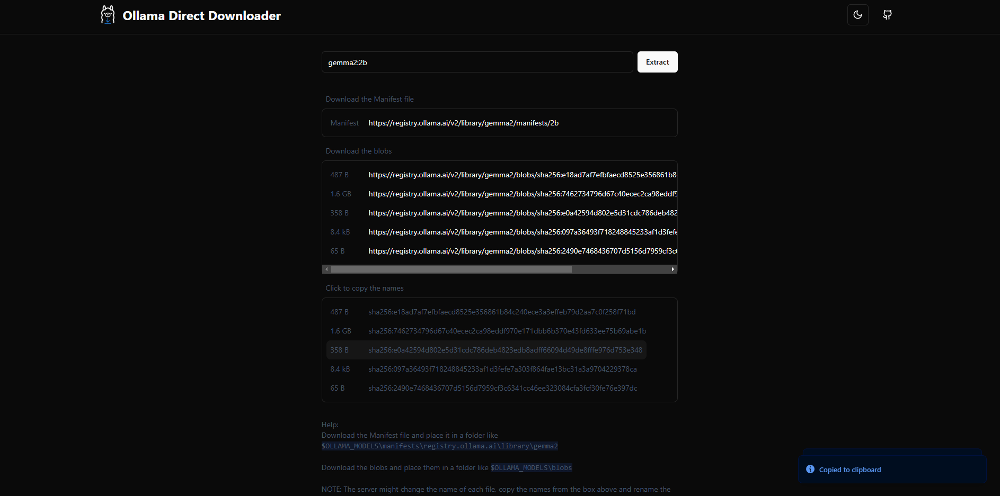
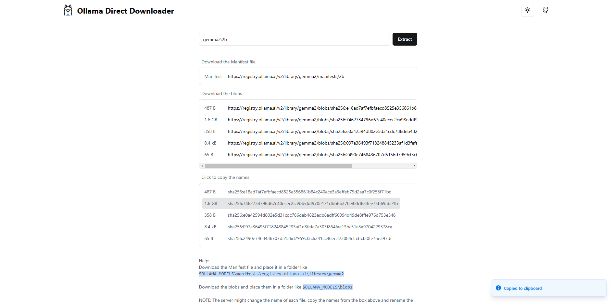

# Ollama Direct Downloader

  

Downloading ollama models using `ollama pull model_name:tag` can be very slow and unreliable sometimes and in some regions. With this tool, you can get the direct download links for ollama models.

## How to use

1. Go to the [Ollama Direct Downloader](https://ollama-direct-downloader.vercel.app/) website.
2. Enter the model name and tag in the search bar. (e.g. `gemma2:2b`)
3. Click the "Extract" button.
4. Download the manifest file and place it in a folder like `$OLLAMA_MODELS\manifests\registry.ollama.ai\library\gemma2`
5. Download the blobs and place them in a folder like `$OLLAMA_MODELS\blobs`

NOTE: The server might change the name of each file, copy the names from the box above and rename the files accordingly.

## Screenshots

## Stack

- React
- Next.js
- Tailwind CSS
- Vercel (CORS proxy api)
- Upstash KV store (Anonymous data is stored on the db for finding bugs)

## Urls

If you need to get the manifest file for a model for your own projects, follow these examples:

`gemma2:2b` model (note the `library/` path):
`https://registry.ollama.ai/v2/library/gemma2/manifests/2b`

`huihui_ai/deepseek-r1-abliterated:8b` model:
`https://registry.ollama.ai/v2/huihui_ai/deepseek-r1-abliterated/manifests/8b`

## License

This project is licensed under the MIT License.

By Gholamreza Dar 2025
